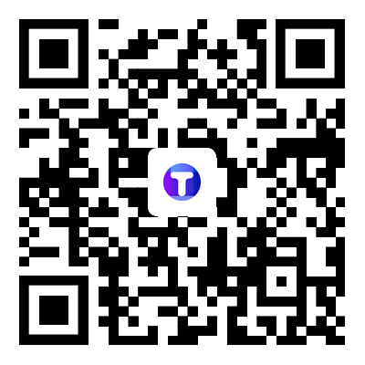

# Blockchain Doc 

By establishing a global repository for blockchain developers, developers from different countries and regions can communicate and collaborate, share experience and technology, and promote the continuous improvement of blockchain technology.

- Promoting innovation and development of blockchain applications;

- Increasing the efficiency of blockchain development;

- Providing more blockchain talent resources for enterprises and individuals.

  

#### Note:

- This documents are named after the name of the network or the abbreviation of the network's crypto.

- If you want your public chain documentation to be included, Please request in "issue" and our team will review and check.

- To know more about Tokenview API, please contact:

  [Telegram](https://t.me/+3-8O9MNLjAI4ZTI9)：

  

  

